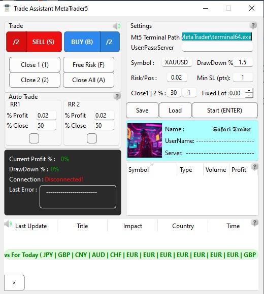

# metatrader5-money-management
A Metatrader 5 Trade Assistant


- [Whats MT5 Assistant](#whats-mt5-assistant)
- [getting Started](#getting-started)

## Whats MT5 Assistant?


## getting Started
1. **Installation**:
First you need install requirements.txt
Python 3.10
3. **Edit**:
edit this lines
```shell
Line 64 : Enter Your Telegram User Id
Line 806 : Enter Your Bot's Token Telegram
Line 889 : Enter A Link For csv Calendar Forex
Line 1499: Enter A Time for License!
```
3. **Info's**
You have tutorial.json file when u pass the tutorial first parameter of it set to Learned You can edit it and set to Not Learned for new User's.

## License
Metatrader5 Money Management is released under the MIT License
